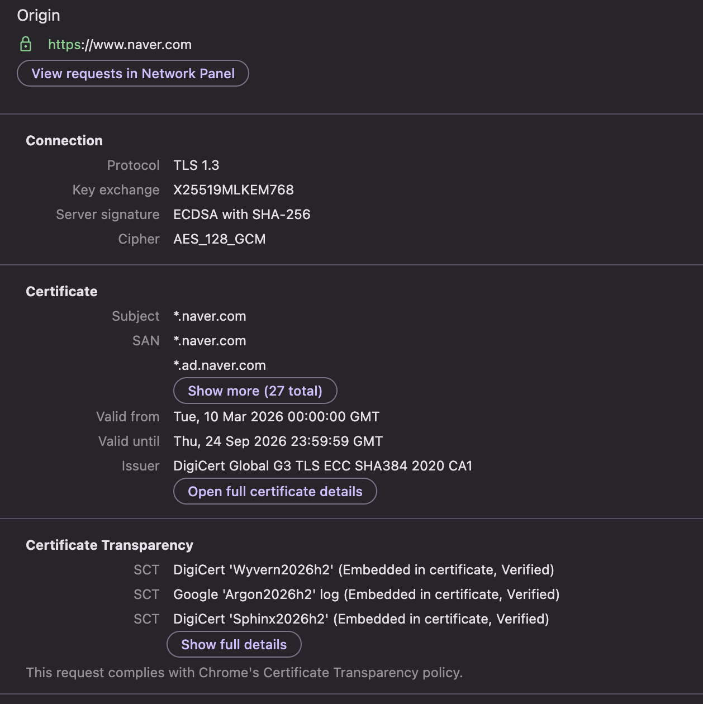

## 개요

- HTTPS(HyperText Protocol Secure)는 [[http-basic|HTTP]]의 보안이 강화된 버전
- 통신의 인증과 암호화를 위해 SSL(Secure Sockets Layer)이라는 암호화 프로토콜을 개발했고 이를 사용하는 HTTPS 등장
- 현대 브라우저는 SSL이 아닌 TLS(Transport Layer Security)를 사용하지만 여전히 SSL이라는 용어는 널리 사용
- TLS 1.0은 사실 SSL 3.1로 개발을 시작했지만 Netscape가 더이상 참여하지 않게 되면서 이를 명시하기 위해 프로토콜의 이름을 변경

## TLS 인증

- TLS는 handshake라는 방식을 통해 통신하는 양측에서 메세지를 교환하여 서로를 인식하고 검증함
- TLS handshake에는 다음 단계가 포함됨
	1. (브라우저) TLS 보안 웹사이트를 열고 웹 서버에 연결
	2. (브라우저) 식별 가능한 정보를 요청하여 웹 서버의 진위 여부 확인 시도
	3. (웹 서버) **공개 키**가 포함된 인증서를 회신으로 보냄
	4. (브라우저) 인증서가 유효하고 웹사이트 도메인과 일치하는지 확인
	5. (브라우저) 일치한다면, 인증서를 통해 획득한 **공개 키**를 사용하여 **세션 키**가 포함된 메세지를 암호화하여 전송
	6. (웹 서버) **개인 키**를 사용하여 메세지를 해독하고 **세션 키** 획득
	7. (웹 서버) **세션 키**를 사용하여 암호화하고 브라우저에 승인 메세지를 보냄
	8. (브라우저, 웹 서버 모두) 동일한 **세션 키**를 사용하여 메세지를 안전하게 교환하도록 전환

## 브라우저에서 확인하기

- 크롬 브라우저의 개발자 도구에서도 TLS 정보를 확인할 수 있음
- Privacy and security 탭 클릭, 없다면 `Cmd + Shift + P`로 찾으면 됨
- 왼쪽 패널에서 도메인 클릭하면 다음과 같은 정보를 볼 수 있음

### Connection (연결 정보)

#### Protocol: TLS 1.3

현재 가장 최신 TLS 버전 (2018년 표준화)
이전 버전보다 핸드셰이크가 빠르고 보안이 강화됨

#### Key Exchange: X25519MLKEM768

두 알고리즘이 **결합된 하이브리드 방식**이라고 함

| 구성 | 설명 |
|------|------|
| **X25519** | 기존 타원곡선 키 교환 알고리즘 (빠르고 안전) |
| **MLKEM768** | 양자 컴퓨터 공격에 대비한 **포스트 퀀텀** 알고리즘 (NIST 표준) |

#### Server Signature: ECDSA with SHA-256

서버의 서명 방식

| 구성 | 설명 |
|------|------|
| **ECDSA** | 타원곡선 기반 디지털 서명 (RSA보다 키가 짧고 빠름) |
| **SHA-256** | 서명에 사용된 해시 알고리즘 |

#### Cipher: AES_128_GCM

실제 데이터를 암호화하는 방식

| 구성 | 설명 |
|------|------|
| **AES_128** | 128비트 키로 대칭 암호화 |
| **GCM** | 암호화 + 무결성 검증을 동시에 수행하는 모드 |

### Certificate (인증서 정보)

#### Subject / SAN (Subject Alternative Name)

이 인증서가 유효한 도메인 목록

- `*.naver.com` — 와일드카드로 서브도메인 전체 커버 (`news.naver.com`, `mail.naver.com` 등)
- `*.ad.naver.com`
- 총 **27개 도메인** 포함

#### Valid From / Until

- 인증서 유효기간: **2026.03.10 ~ 2026.09.24** (약 6개월)
- 보안 강화 목적으로 요즘 인증서 유효기간이 점점 짧아지는 추세라고 함

#### Issuer: DigiCert Global G3 TLS ECC SHA384 2020 CA1

이 인증서를 발급한 **인증기관(CA)**

- DigiCert는 세계 최대 CA 중 하나
- 브라우저는 이 CA를 신뢰하기 때문에 네이버 인증서도 신뢰하게 됨

### Certificate Transparency (인증서 투명성)

인증서가 **공개 로그 서버에 등록되었는지** 확인하는 제도

#### SCT (Signed Certificate Timestamp)

타임스탬프 서명

| 로그 서버 | 상태 |
|-----------|------|
| DigiCert 'Wyvern2026h2' | Embedded in certificate, Verified ✅ |
| Google 'Argon2026h2' | Embedded in certificate, Verified ✅ |
| DigiCert 'Sphinx2026h2' | Embedded in certificate, Verified ✅ |

- DigiCert, Google 두 곳 이상의 독립 로그에 등록되어야 Chrome이 신뢰함
- 악의적인 CA가 몰래 가짜 인증서를 발급하는 것을 방지하는 역할
- "This request complies with Chrome's Certificate Transparency policy" → CT 요건을 통과했으니 안전하다는 의미

정리하자면, 네이버는 **TLS 1.3 + 포스트 퀀텀 키교환(MLKEM768)** 까지 적용된 최신 보안 설정을 사용 중

## 참고

- [TLS 핸드셰이크란 무엇일까요?](https://www.cloudflare.com/ko-kr/learning/ssl/what-happens-in-a-tls-handshake/)
- [SSL/TLS 인증서란 무엇인가요?](https://aws.amazon.com/what-is/ssl-certificate/)
