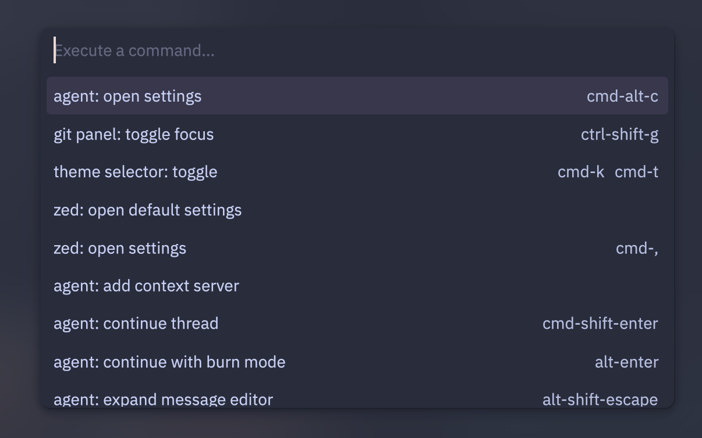
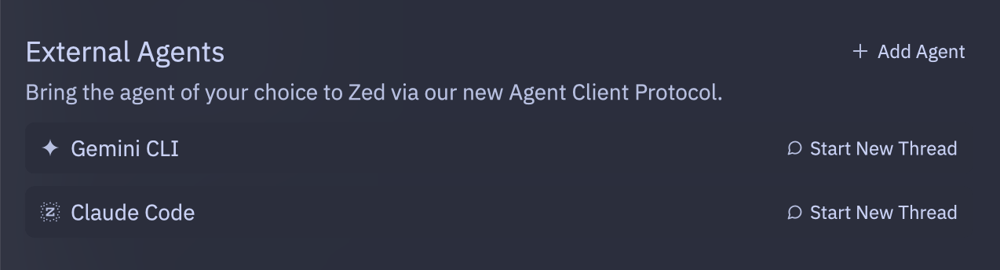

# Agent Client Protocol(ACP)

최근 개발툴 생태계에서 다양한 AI 에이전트와의 연동이 점점 중요해지고 있습니다. 이런 흐름에  Zed 팀이 발표한 Agent Client Protocol(ACP)은 정말 가뭄에 단비같은 프로토콜입니다. ACP가 뭔지, 그리고 Zed와 Neovim에서 어떻게 활용되는지 간단하게 정리해봤습니다.

## ACP란?

ACP(Agent Client Protocol)는 코드 에디터와 AI 에이전트(예: Gemini CLI, Claude Code 등)가 서로 쉽게 통신할 수 있도록 만든 오픈소스 프로토콜입니다. 핵심은 에디터가 특정 에이전트에 종속되지 않고, 다양한 에이전트를 자유롭게 선택해 사용할 수 있다는데 의의가 있어요.

- 기술적으로는 JSON-RPC 기반의 엔드포인트를 통해 에이전트와 클라이언트가 통신합니다.
- 오픈소스라서 누구나 구현할 수 있고, 에디터나 에이전트 개발자 모두 자유롭게 확장할 수 있다고 해요.

## Zed에서의 ACP 활용

Zed 에디터는 ACP의 레퍼런스 구현체로 Google의 Gemini CLI를 통합했습니다.

- Gemini CLI를 Zed 내에서 서브프로세스로 실행, ACP를 통해 실시간 코드 편집, 멀티버퍼 리뷰, 코드-에이전트 간 자유로운 이동 등 다양한 개발자 친화적 기능을 제공합니다.
- Zed의 자체 에이전트도 ACP 기반으로 동작해서, 동일한 UI와 기능을 서드파티 에이전트에도 개방하고 있어요.
- 데이터 프라이버시도 신경 써서, 에이전트와의 상호작용 시 Zed 서버에 코드가 저장되거나 접근되지 않습니다.

먼저 **agent: open settings** 메뉴를 엽니다.  



**External Agents** 메뉴에서 Gemini CLI와 스레드를 시작하면 자동으로 설치되어 바로 이용할 수 있습니다.  



현재(2025.08.31)로서는 Claude Code가 공식 지원되지는 않지만 한번 붙여볼 수는 있어요. 

```bash caption="이걸 먼저 설치하고"
npm i -g @zed-industries/claude-code-acp
```

**Add Agent**를 클릭하고 아래 항목을 추가하면 됩니다.
```json
  "agent_servers": {
    "Claude Code": {
      "command": "claude-code-acp"
    }
  },
```

경로 문제가 발생한다면, [이 글](https://github.com/anthropics/claude-code/issues/6686#issuecomment-3238888399)을 참고해서 파일을 수정하면 됩니다. 

하지만 UX가 완전하진 않아서, Claude Code는 공식 지원을 기다리는 편이 좋을 것 같습니다. 최근 직장에서 Claude Code를 적극 사용해보고 있는데, IDE 통합이 아쉽다고 생각하던 참에 이런 소식을 접하게 되어 정말 기대가 됩니다. 커서에 익숙한 동료 개발자분들도 보다 쉽게 Claude Code를 사용해볼 수 있겠네요.

## Neovim(CodeCompanion)에서의 ACP 활용

제가 사용하는 Neovim에서도 CodeCompanion 플러그인(v17.18.0 이상)을 통해 ACP를 지원합니다.

```lua caption="디폴트로 적용하고 싶다면, 어댑터 설정만 넣어주면 됩니다"
strategies = {
  chat = {
    adapter = 'gemini_cli',
  },
},
```

Claude Code 또한 codeCompanion 패키지에 직접 추가하는 방식으로 연결할 수는 있지만, 기능적으로 한계가 있어 공식 지원을 기다려야 할 것 같습니다.

# 참고

- [https://zed.dev/blog/bring-your-own-agent-to-zed](https://zed.dev/blog/bring-your-own-agent-to-zed)
- [https://github.com/olimorris/codecompanion.nvim/discussions/2030](https://github.com/olimorris/codecompanion.nvim/discussions/2030)
- [https://github.com/anthropics/claude-code/issues/6686#issuecomment-3238888399](https://github.com/anthropics/claude-code/issues/6686#issuecomment-3238888399)
