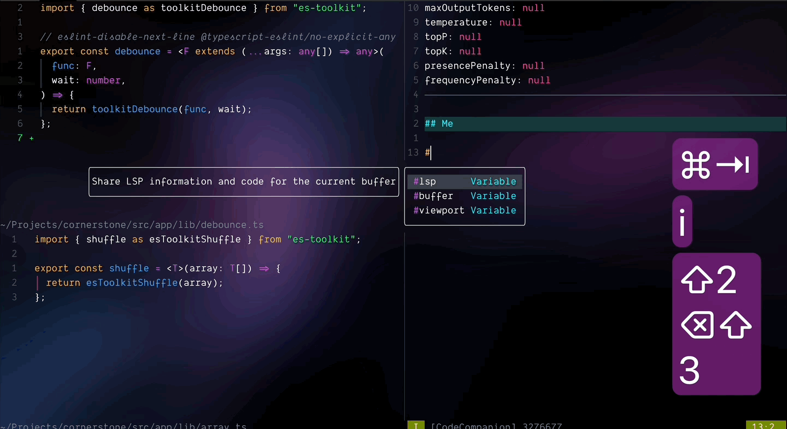

import { Callout } from "@/app/components/callout.tsx";

최근 Cursor, VSCode Copilot, Windsurf 등 AI 도구와 통합된 IDE의 인기가 한창입니다. Neovim에도 AI를 활용할 수 있는 다양한 플러그인이 있습니다. 그 중에서 제가 요즘 즐겨 사용하는 **CodeCompanion** 에 대해 소개하려고 해요.

## 소개

**CodeCompanion**은 Neovim에서 AI를 활용해 코딩 생산성을 높이는 플러그인입니다. GitHub Copilot, Zed AI와 같은 도구의 장점을 Neovim에 통합할 수 있습니다. 다양한 LLM을 연동할 수 있기 때문에 자신의 용도와 예산에 맞는 AI를 선택할 수 있습니다.

- Anthropic (Claude)
- OpenAI (ChatGPT)
- DeepSeek
- Gemini
- Mistral AI
- Ollama (로컬 LLM)

`CodeCompanion`은 주요 기능은 다음과 같습니다.

- 다양한 LLM 연동 가능
- 챗/인라인 모드 지원
- LLM 출력을 향상시키기 위한 다양한 도구 지원
- 프롬프트 및 다양한 도구의 커스터마이징 지원

## 설치

### 사전 준비

CodeCompanion을 설치하기 전 필요한 것들입니다.

- **Neovim 0.10.0 이상**: `:version` 명령어로 확인 가능
- **curl**: API 통신을 위해 필요, 터미널에서 `curl --version`으로 확인 가능

### 플러그인 설치

저는 **lazy.nvim**을 사용하고 있습니다.
다음 코드를 `~/.config/nvim/lua/plugins.lua` 또는 본인 설정에 맞는 경로에 추가해 주세요.

```lua title="lazy.vim 예시"
{
  "olimorris/codecompanion.nvim",
  config = true,
  dependencies = {
    "nvim-lua/plenary.nvim",
    "nvim-treesitter/nvim-treesitter",
  },
}
```

<Callout title="Tip">
	
- `:Lazy sync`를 실행하면 재시작하지 않고 설치할 수 있습니다.
- `:checkhealth codecompanion` 명령어로 정상 설치 여부를 확인할 수 있습니다.
	
</Callout>

## 기본 설정

### API 키 설정

OpenAI, Anthropic 등 외부 LLM을 사용하려면 API 키가 필요합니다. 예를 들어, OpenAI API 키를 설정하려면:

1. [OpenAI 플랫폼](https://platform.openai.com/)에서 계정을 만들고 API 키를 발급받습니다.
2. 터미널 환경 변수로 설정합니다.

```bash title="./zshrc" caption="보안을 위해 하드코딩보다는 환경 변수에 등록하는 것이 좋습니다."
export OPENAI_API_KEY="your_api_key"
```

### 어댑터 설정

`os.getenv`를 통해 API 키를 가져옵니다. 예를 들어, Anthropic의 Claude를 사용하려면:

```lua
{
  "olimorris/codecompanion.nvim",

  -- ...

  opts = {
    adapters = {
      default = "anthropic",
      anthropic = {
        api_key = os.getenv 'ANTHROPIC_API_KEY',
        model = "claude-3.7-sonnet",
      },
    },
  },
}
```

inline과 chat에서 다른 LLM을 사용하고 싶다면 이렇게,

```lua
{
  "olimorris/codecompanion.nvim",

  -- ...

  opts = {
    strategies = {
      chat = {
        adapter = "anthropic",
      },
      inline = {
        adapter = "deepseek",
      },
    },
  },
}
```

같은 회사 제품이지만 다른 다른 모델을 사용하는 경우 커스텀 어댑터를 설정하는 방법도 있습니다.

```lua title="gemini의 서로 다른 모델 적용"
{
  "olimorris/codecompanion.nvim",

  -- ...

  opts = {
    adapters = {
    chat = function()
      return require('codecompanion.adapters').extend('gemini', {
        env = {
          api_key = os.getenv 'GEMINI_API_KEY',
        },
        schema = {
          model = {
            default = 'gemini-2.5-pro-exp-03-25',
        },
        },
      })
    end,
    inline = function()
      return require('codecompanion.adapters').extend('gemini', {
        env = {
          api_key = os.getenv 'GEMINI_API_KEY',
        },
        schema = {
          model = {
            default = 'gemini-2.0-flash',
          },
        },
      })
      end,
    },
    strategies = {
      chat = {
        adapter = 'chat',
      },
      inline = {
        adapter = 'inline',
      },
    },
  },
}
```

## CodeCompanion 시작하기

### Chat Buffer 사용법

`:CodeCompanionChat` 명령어로 **Chat Buffer**를 열면 AI와 대화를 시작할 수 있습니다.


저는 `<leader>ac`로 새 채팅을 열고 `<leader>at`로 토글하고 있어요.

```lua title="키 매핑 예시"
local prefix = '<leader>a'

{
  "olimorris/codecompanion.nvim",

  -- ...

  keys = {
    {
      prefix .. 'c',
      '<cmd>CodeCompanionChat<cr>',
      mode = { 'n', 'v' },
      desc = 'New Chat',
    },
    {
      prefix .. 't',
      '<cmd>CodeCompanionChat Toggle<cr>',
      mode = { 'n', 'v' },
      desc = 'Toggle Chat',
    },

    -- ...
  },
}
```


Chat Buffer에서 최근 제안된 코드를 복사(yank)하려면 `gy`를 누르면 됩니다.

<Callout title="Tip">
	
이 밖에도 `?`를 입력하면 다양한 단축키를 확인할 수 있어요.
	
</Callout>

### Inline Assistant 사용법

**Inline Assistant**는 코드 작성 중 AI의 도움을 받는 기능입니다. 예를 들어:

`:CodeCompanion 주석을 추가해줘`와 같이 AI에게 무언가를 요청할 수 있어요.


### Action Palette 사용법


`:CodeCompanionActions`으로 **Action Palette**를 열어 다양한 기능을 선택할 수 있습니다.

내가 직접 만든 프롬프트로 일을 시킬 때 유용한데 프롬프트 직접 만드는 내용은 **심화편**에서 다루겠습니다.

## 5. 유용한 기능들

chat과 inline 기능만으로도 많은 일을 할 수 있지만 이밖에도 유용하고 편리한 기능이 있습니다.  
그 중에서 먼저 **Variables**를 소개하겠습니다.

### Variables 사용법

**Variables**를 통해 현재 버퍼, LSP 및 Viewport에 관한 정보를 AI에게 쉽게 공유할 수 있습니다.

#### #buffer

먼저 `#buffer`는 마지막으로 사용한 버퍼의 전체 내용을 공유합니다.  
개인적으로 가장 자주 사용하는 변수예요.


단, 버퍼에 있는 코드가 바꼈을 때 이를 자동으로 감지하지는 않습니다. 이런 경우 필요에 따라 `#buffer{pin}`, `#buffer{watch}`처럼 옵션을 적용할 수 있습니다.

- `pin`은 이름 그대로 버퍼를 고정하여 항상 최신 데이터를 공유합니다. 다만 전체 사본을 붙여넣기 때문에 매번 많은 토큰이 소모되는 점을 주의해야 합니다.
- 그래서 저는 `watch`를 더 선호해요. `watch`는 변경 사항을 추적해서 해당 내용만 업데이트하는 방식이라 토큰을 절약할 수 있습니다.


<Callout title="Tip">
	
버퍼를 먼저 공유하고 `gp`, `gw` 단축키로 `pin`, `watch`를 나중에 적용할 수 있어요.
	
</Callout>

#### #lsp


다음으로 `#lsp`는 현재 버퍼에 활성화된 LSP 서버의 모든 정보를 공유합니다. 가령 타입스크립트를 작성하고 있다면, `typescript-language-server`가 동작하고 있을텐데요. 타입 에러로 LSP가 진단 에러를 보여주고 있다면 `#buffer`와 함께 LSP 정보를 공유하여 효과적으로 디버깅할 수 있습니다.

#### #viewport



마지막으로 `#viewport`는 응답이 전송되는 시점에 화면에 표시되는 내용을 공유합니다. 여러 화면을 한번에 전달하고 싶을 때 유용합니다.


### Slash Commands 사용법

슬래시 기호로 시작하는 **Slash Commands**는 변수보다 더 확장된 기능을 제공합니다.

#### /buffer


`/buffer`는 현재 활성화된 버퍼를 선택하고 이를 공유할 수 있습니다.

#### /fetch


`/fetch`는 [jina.ai](https://jina.ai/)를 통해 웹페이지 정보를 가져오고 이를 공유하는 기능입니다. 오토 캐싱도 지원하기 때문에 이전과 같은 동일 요청인 경우 캐시 데이터 사용 여부를 선택할 수 있어요.

#### /terminal


`/termianl`은 터미널의 최근 출력을 공유합니다. 단, Vim의 `:terminal`로 실행시킨 터미널 버퍼 한정입니다.

이 밖에도 `/help`, `/symbols`, `/now`, `/workspace` 등의 커맨드를 제공합니다.

### Agents and Tools 사용법

**Agents**는 특정 작업(예: 코드 리뷰, 문서 생성)을 전문적으로 수행하는 AI입니다. LLM은 외부 도구를 활용할 수 있어서 MCP가 요즘 한창이죠. CodeCompanion에서도 MCP를 활용할 수 있고 도구를 직접 추가하는 방법도 제공하지만, 여기서는 기본으로 갖고 있는 도구를 먼저 살펴보려고 합니다.

#### @cmd_runner


`@cmd_runner`는 사용자의 컴퓨터에서 명령을 실행할 수 있는 도구입니다. 도구를 쥐어주고 터미널 명령어를 실행해보세요.

#### @editor


`@editor`는 Neovim 버퍼에서 코드를 수정할 수 있는 도구입니다. `#buffer{watch}`와 함께 도구를 쥐어주고 해당 버퍼에 대한 편집을 연속적으로 요청할 수도 있죠.

#### @files


`@files`로 사용자 디스크에서 다양한 파일 작업을 수행할 수 있습니다. 다음 작업들이 가능합니다.

- 파일 생성
- 파일 읽기
- 파일에서 줄 읽기
- 파일 편집
- 파일 삭제
- 파일 이름 바꾸기
- 파일 복사
- 파일 이동

#### @full_stack_dev

마지막으로 `@full_stack_dev`는 `@cmd_runner`, `@files`, `@editor`을 모두 합친 강력한 도구입니다. 하지만 경험상 바이브 코딩이 가능할 정도는 아니었어요. 제가 제대로 사용하지 못한 것인지는 몰라도 주어진 도구를 제대로 활용하지 못하는 경우도 많았습니다.

```md title="이건 공식 문서에 있는 예시"
@full_stack_dev I want to play Snake. Can you create the game for me in Python and install any packages you need. Let's save it to ~/Code/Snake. When you've finished writing it, can you open it so I can play?
```

## 6. 마치며

지금까지 Neovim을 위한 AI 플러그인 **CodeCompanion** 에 대해 알아보았습니다. 사실 요즘에는 강력한 도구들이 많고 어쩌면 Neovim 생태계가 충분한 속도로 따라가지 못하고 있다는 생각이 들기도 합니다. 하지만 Vim이 가지는 강점은 여전하고 여러 선량하고 능력있는 분들 덕분에 AI에 관한 생태계도 나날이 발전하고 있어 기대를 하고 있습니다.

다음 **심화편**에서는 이 플러그인을 더 확장하해서 이용하는 내용을 담아보려고 합니다.
