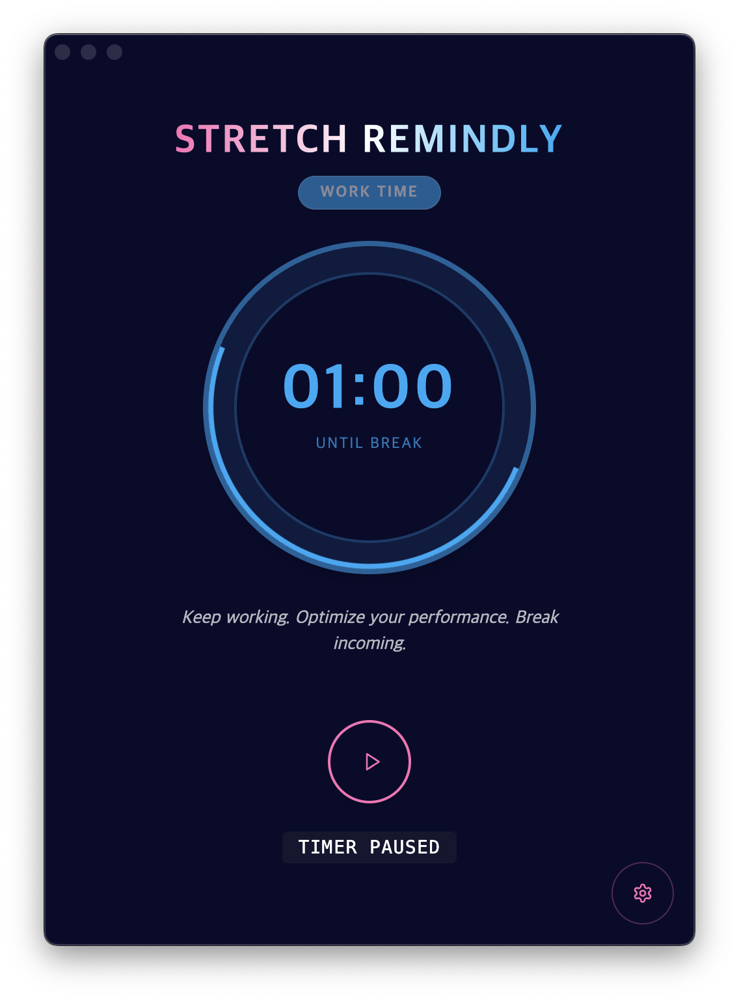

작년 4월에 시작한 프로젝트, **Stretch Remindly**에 착수한지도 정말 오랜 시간이 지났습니다. 기어코 2026년이 도래했군요.

정식으로 출시하거나 제대로 홍보한 적은 없지만, **Stretch Remindly**에도 많은 변화가 있었습니다. 우선 디자인에 큰 변화가 있었어요.

꽤나 다양한 변천이 있었는데 현재 사진으로 남아있는 예전 모습은 요렇습니다.

Ver 1.

Ver 2.

(중간 버전들이 조금 더 있었는데 사진을 남기지 못했군요 😢)

이전 버전에서는 주로 사이버펑크틱한 색상과 다이내믹한 애니메이션을 보여줬다면, 지금은 릴렉스한 느낌을 주려고 합니다. 잠시라도 집중하고 몰입하던 화면에서 벗어날 수 있는 경험을 전달하고 싶었어요.

Current Version

제품을 만들 때 먼저 컨셉을 정하는 것이 중요하단 사실을 알게 됐어요. 컨셉이야 언제든지 바뀔 수 있긴 하지만, 기획이나 디자인의 방향을 잡는 것이 훤씬 수월했습니다. **React Bits**에서 제공하는 요소를 여럿 활용했어요. 앞으로 테마를 더 추가할 예정인데, 기본 테마는 아마도 유지할 것 같습니다.

Comment Feature

기능적으로도 작은 변화를 주었어요. 스트레칭 화면은 스트레칭을 생략할 수 있는 스킵 버튼도 보여주는데 사용자가 설정에서 스킵 버튼을 생략할 수 있도록 했어요. 한편, 스킵 버튼에 마우스를 올리면 스트레칭의 중요성을 일깨워주기도 합니다. 그리고 자잘한 디테일과 버그들을 수정했어요.

한편, 코드는 꽤나 많이 건드려야 했어요. 이전에 바이브코딩한 것을 바꾸고 유지보수하려다 보니 어려운 점이 많았습니다. 불필요한 코드를 걷어내고, 대대적인 리팩토링을 했어요. 바이브코딩의 부채를 실감했습니다. 그럼에도 요즘의 코딩 에이전트에게 작업을 위임할 때, 어느 정도 갖춰진 구조가 있다면 꽤나 잘 작동한다는 사실도 느끼고 있습니다. 이미 갖춰진 아키텍처나 테스트 코드가 있다면, AI가 이를 참고하기 때문에 큰 부채가 되는 코드를 많이 양산하진 않더군요.

근데 이 앱은 처음부터 이렇다 할 가이드 없이 순수 바이브코딩으로 만들었기 때문에 부채가 상당했어요. 결과적으로는 제가 일하기 좋은 환경을 만들기 위해 시간을 쏟아야 했습니다. 그리고 리팩토링 이후에는 AI에게 다시 많은 도움을 받고 있습니다. 그동안 코딩 에이전트도, 저의 프롬프팅도 발전해서일까요. 이제는 생산성에 도움이 된다고 느껴요.

앱을 다 개발했으니 출시를 해야 합니다. 잘 홍보할 자신은 없고, 무료 앱이기도 하니 가볍게 끌고 가고 싶은데요. 처음에는 **GitHub Artifacts**와 랜딩 페이지를 거쳐 다운로드를 제공했지만, 아무래도 사이트 유입이 있을 턱이 없죠. 그래서 앱스토어에 등록하기로 결정했습니다. 제가 그랬듯이 필요한 사람이 검색해서 받을 수 있도록 말이죠.

Icon from AI

하지만 앱 출시를 위해 해야 할 것들이 너무 많다고 느꼈어요. 아이콘도 만들어야 하고, 앱스토어에는 정말 많은 절차와 관문이 있었어요. 앱 아이콘도 처음에는 AI로 만들어 보았습니다. **나노 바나나**를 써보기도 하고, **ComfyUI**에서 **Flux** 등을 사용한 워크플로우도 만들어 보았지만 제 마음에 드는 결과는 얻지 못했습니다.

App Icon

나중을 위해서라도 앱 아이콘 정도는 직접 만들 수 있는 것이 좋겠다 싶어서, 피그마를 시작했어요. 피그마 공식 홈페이지에서 제공하는 튜토리얼을 따라하고 난 후 이런 형체 모를 아이콘을 만들었습니다.

이때 피그마를 조금이라도 배워둔 것이 이후에도 큰 도움이 되었어요. 트레이 아이콘을 바꾸고, 앱 스토어 출시를 위한 미디어 에셋을 피그마를 통해 만들었습니다. 앞으로도 생각한 것을 어렵지 않게 표현할 수 있을 정도까지는 배워보고 싶어요. 자주 쓰는 것이 상책이겠죠.

Demo Feature

한편, 데모 영상을 만들기도 했습니다. Mac에서 기본 화면 녹화를 제공하기도 하지만, 클릭 이펙트를 주고 싶어서 **loom**이라는 앱으로 화면을 녹화했어요. 다른 여러 서비스들의 것이 그러하듯이, 줌인, 줌아웃 효과도 내고 싶었어요. 비디오 편집은 한번도 해본 적이 없어서 간편한 도구를 찾아봤지만 대부분 유료에다가 제가 원하는 것 이상으로 커다란 앱이 많았습니다.

그래서 그냥 Mac에서 기본적으로 제공하는 **iMovie**를 써보기로 합니다. 조금은 투박한 도구지만 여러 시행착오 끝에 원하는 영역을 줌 인아웃하는 것도 성공했어요.

이번 경험을 통해서, 단 하나의 서비스를 출시하기 위해서 개발 외적으로도 해야하는 번거로운 일이 많다는 점을 배울 수 있었습니다. 그리고 이 과정을 통해 앞으로도 더 자주, 그리고 편리하게 앱을 출시할 수 있는 스킬과 경험을 갖추고 싶다는 생각을 했어요. 
다행히도 앱 심사는 큰 어려움 없이 통과했어요. 한 명의 유저라도 제가 만든 앱을 서비스를 써준다면 감회가 남다를 것 같아요.

Previous Size

아, 그리고 **Stretch Remindly**의 다음 목표는 용량을 줄이는 것입니다. 지금 설치 용량이 거의 **500MB**에 육박하는데 이런 단순한 리마인더 앱의 크기로는 스스로도 용납하기 어렵네요. 크로미움을 내장하는 일렉트론의 한계이기도 하고, 심지어 MacOS의 두 아키텍처를 모두 지원하기 위해 유니버설 패키지로 빌드했기 때문인데요. 아마도 조만간 **Tauri**로 갈아타는 선택을 할 것 같습니다.

그럼 다음에 찾아 뵙겠습니다.

**Stretch Remindly**를 많이 사랑해주세요. 감사합니다.

