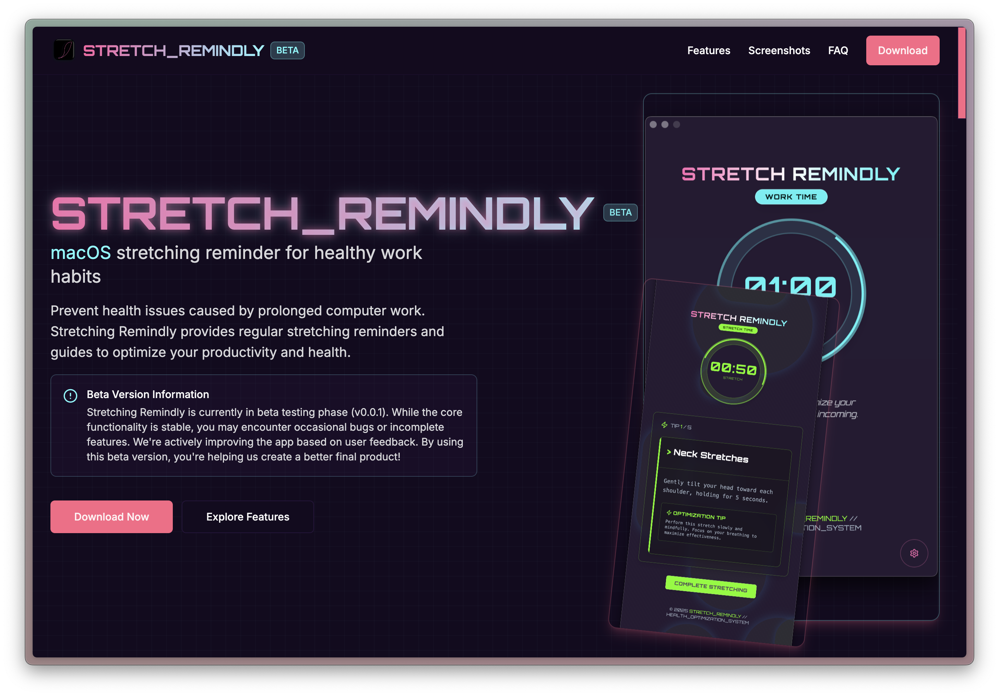

바이브 코딩을 직접 해봤습니다. **Stretch Remindly** 라는 이름으로 컴퓨터 앞에 오래 앉아 있는 사람들을 위한 스트레칭 리마인더 앱을 만들겁니다.

당장은 MacOS 앱으로 개발할 목적입니다. 제가 Mac 유저이기 때문이죠 ㅎㅎ

## PRD 작성 요청

먼저 **PRD(Product Requirement Document)** 작성을 요청했습니다. PRD란 만들고자 하는 제품의 요구사항을 정의한 문서를 뜻합니다.

다른 툴을 사용하기에 앞서 우선 **Claude Sonnet 3.7**에게 부탁했어요.

```md title="Me"

개발자나 컴퓨터 앞에 오래 앉아 있는 사람들의 관절 건강을 위한
스트레칭 리마인더 앱을 개발하려고 해.

우선 MacOS에서 구동 가능한 데스크탑 앱으로 개발할건데, 먼저 PRD를 작성하고 싶어.

나를 위해 PRD를 작성해주면 좋겠어. 내가 생각하는 주요 기능은 아래와 같아.

1. 사용자는 자신에게 적합한 시간을 설정할 수 있음
2. 타이머를 실행하면 설정된 시간마다 스트레칭을 하도록 유도함
3. 설정한 시간이 되면 타이머는 리셋되고 스트레칭 화면이 표시됨
4. 화면에는 남은 스트레칭 시간이 표시됨
5. 스트레칭 시간도 사용자가 설정할 수 있음(그러나 건강을 위한 최소 스트레칭 시간은 필요함)
6. 스트레칭 시간이 끝나면 타이머가 재개되고 스트레칭 화면이 사라짐
7. 1부터 6까지의 과정이 반복되고, 사용자는 타이머를 종료할 수도 있음

이 밖에도 히스토리를 보여준다던가, 스트레칭 팁을 제공하거나,
어떤 코칭을 제공하는 부가 기능도 고려하고 있어.
```

```md title="Claude Sonnet 3.7" caption="뭔가 그럴듯 합니다...!"
## 제품 개요

개발자와 컴퓨터 앞에 오래 앉아있는 사람들의 관절 건강을 위한 MacOS 스트레칭 리마인더 애플리케이션으로,
정기적인 스트레칭 알림을 통해 장시간 앉아있음으로 인한 신체적 문제를 예방합니다.

## 핵심 기능

### 타이머 설정
- 사용자가 스트레칭 알림 간격 직접 설정 (15분~120분)
- 기본값: 45분 (사용자 변경 가능)
- 시작/일시정지/재설정 기능

### 알림 시스템
- 설정 시간 경과 시 스트레칭 알림 표시
- MacOS 알림 센터 통합
- 알림 무시/연기 옵션 (5, 10, 15분 후 재알림)

### 스트레칭 화면
- 알림 클릭 시 스트레칭 가이드 화면 표시
- 현재 스트레칭 동작 안내 및 남은 시간 표시
- 프로그레스 바로 진행 상황 시각화

### 스트레칭 시간 관리
- 사용자 지정 스트레칭 세션 시간 (최소 3분 권장)
- 기본값: 5분 (사용자 변경 가능)
- 스트레칭 중 일시정지 옵션

### 사이클 관리
- 스트레칭 완료 후 자동 타이머 재시작
- 사용자가 언제든 사이클 중단/재개 가능
- '방해 금지' 모드 지원 (회의, 발표 중 알림 중지)

## 부가 기능

### 스트레칭 히스토리
- 일일/주간/월간 스트레칭 통계
- 완료한 스트레칭 세션 수와 총 시간
- 스트레칭 습관 시각화 차트

### 스트레칭 라이브러리
- 다양한 신체 부위별 스트레칭 동작 제공
- 사용자 맞춤형 스트레칭 루틴 저장
- 컴퓨터 작업자 특화 스트레칭 추천

### 코칭 및 피드백
- 스트레칭 중 음성 가이드 (선택 사항)
- 스트레칭 효과 향상을 위한 팁 제공
- 사용자 습관 기반 맞춤형 권장사항

## 기술 요구사항
- macOS 10.15 (Catalina) 이상 지원
- Swift/SwiftUI 기반 네이티브 앱
- 메뉴 바 아이콘을 통한 빠른 액세스
- 시스템 시작 시 자동 실행 옵션

## 미래 고려사항
- iOS/iPadOS 버전 확장
- Apple Watch 통합
- 건강 앱(Health App) 데이터 연동
- 눈 건강을 위한 20-20-20 규칙 알림 추가
```

## 기술 스택 선정

무엇을 구현해야 할지 정했으니, 어떤 도구를 쓸지 정해야 정해야 합니다. 그나마 경험이 있는 **Electron**과 **Flutter** 중 하나로 추천을 해달라고 했어요.

```md title="Me"
이제는 개발을 시작하기에 앞서 개발 스택을 정해야해.
나는 Electron과 Flutter 경험이 있어서 둘 중 하나로 개발을 하고 싶은데, 어떤 스택으로 하는 것이 좋을까?
React, Typescript 경험에 비해 Electron 경험은 풍부한 편은 아니야.
Flutter는 최근 개발하고 있는 서비스가 있지만 데스크탑 앱을 개발하는 건 또 아니고...

한편, 이 앱을 스트레칭 화면을 보여줄 때를 제외하고는 상태표시줄 기반으로 동작하게 하고 싶어.
상태표시줄에 아이콘을 표시하고 아이콘을 클릭하면 나오는 팝업을 통해 여러 설정을 할 수 있도록 말이지.
```

```md title="Claude Sonnet 3.7"
## 개발 스택 추천: Electron vs Flutter

주어진 요구사항과 경험을 고려했을 때, **Electron**이 더 적합할 것 같습니다:

### Electron 선택 이유

- **기존 경험 활용**: React와 TypeScript 경험이 많으신 것을 최대한 활용할 수 있습니다
- **MacOS 메뉴바 통합**: 상태표시줄(메뉴바) 앱 개발이 잘 지원됩니다
- **시스템 알림 접근성**: MacOS 알림 시스템과 쉽게 통합 가능합니다
- **플랫폼 API**: 타이머, 자동 실행 등 시스템 기능 접근이 용이합니다

### 추천 기술 스택

- Electron: 메인 프레임워크
- React + TypeScript: UI 구현
- electron-tray/menubar: 상태표시줄 구현
- electron-store: 사용자 설정 저장
- node-notifier: 시스템 알림 통합

### Flutter 고려사항

Flutter로도 구현 가능하지만, MacOS의 메뉴바 앱 개발이 Electron보다 복잡하고,
데스크탑 앱 경험이 부족하다면 구현 과정에서 더 많은 학습 비용이 발생할 수 있습니다.

상태표시줄 앱과 알림 시스템이 핵심인 이 프로젝트에서는
Electron의 네이티브 OS 통합 기능이 더 큰 이점을 제공할 것입니다.
```

**Electron**을 추천해주네요. 그렇다면 **Electron**으로 정해보겠습니다.

## 계획 세우기

전체적인 계획도 세워달라고 했어요.

```md title="Me"
구체적인 계획을 세우는게 좋겠어. 
먼저 핵심 기능 위주로 동작하는 무언가를 만들고 싶어.
그리고 부가 기능까지 고려해서 향후 계획까지 세워주면 고맙겠어.
```

```md title="Claude Sonnet 3.7"
# 스트레치타임(StretchTime) 개발 계획

## 개발 접근법

핵심 기능을 먼저 구현하는 MVP(Minimum Viable Product) 접근법이 가장 효과적일 것입니다.
이를 통해 기본 기능을 빠르게 구현하고 테스트할 수 있습니다.

## 개발 단계 계획

### 1단계: 핵심 기능 (MVP)
1. 프로젝트 설정
   - Electron + React + TypeScript 초기 설정
   - 메뉴바 아이콘 설정 (electron-tray/menubar 활용)

2. 타이머 시스템
   - 사용자 설정 시간 저장 (electron-store)
   - 타이머 로직 구현 (setInterval 활용)
   - 타이머 상태 관리 (Zustand)

3. 알림 시스템
   - macOS 네이티브 알림 구현 (node-notifier)
   - 알림 클릭 시 스트레칭 화면 표시

4. 스트레칭 화면
   - 기본 스트레칭 안내 화면
   - 카운트다운 타이머 및 진행 표시
   - 스트레칭 완료 후 타이머 재시작

### 2단계: 부가 기능
1. 스트레칭 히스토리
   - 로컬 데이터베이스 구현 (IndexedDB)
   - 통계 데이터 시각화 (Chart.js/Recharts)

2. 스트레칭 라이브러리
   - 다양한 스트레칭 동작 데이터 구조
   - 카테고리별 스트레칭 UI 구현

3. 코칭 및 피드백
   - 음성 가이드 시스템
   - 스트레칭 효과 팁 데이터베이스

4. 사용자 환경 최적화
   - 방해 금지 모드
   - 자동 시작 옵션 (app.setLoginItemSettings)
   - 다크/라이트 모드 지원

### 3단계: 최적화 및 배포
1. 성능 최적화
   - 메모리 및 CPU 사용량 최적화
   - 시작 시간 개선

2. UX 개선
   - 애니메이션 및 전환 효과
   - 접근성 강화

3. 배포 준비
   - macOS 코드 서명 및 공증
   - 자동 업데이트 시스템 (electron-updater)

## 기술 스택 세부사항
- **프론트엔드**: React + TypeScript, TailwindCSS, shadcnUI
- **상태관리**: Zustand
- **데이터 저장**: electron-store(설정), IndexedDB(히스토리)
- **메뉴바 관리**: menubar 라이브러리
- **알림 시스템**: node-notifier
```

꽤나 그럴듯한 계획입니다.

## 바이브코딩

이제 바이브코딩을 할 단계입니다. 직접 IDE를 통해 AI 요청하기 보다는 **Bolt**, **Lovable**, **v0**와 같은 플랫폼을 사용해 보기로 했어요.

### v0 체험

이 중에서 [v0](https://v0.dev/)을 먼저 사용했습니다. 지금까지 정리한 것들을 검토해달라고 했어요.


이제 만들어줘.


5분 내로 모든 코드를 작성하는 것을 볼 수 있었습니다. 하지만, `package.json`, `tsconfig` 등이 보이지 않아, 다시 요청을 해봤습니다.


일렉트론을 위한 미리보기는 제공하지 않기 때문에 로컬에서 직접 구동시켜 볼 차례입니다.


화면 상단에 `Add to Codebase` 메뉴를 제공하는데 **shadcn**을 통해 코드를 추가할 수 있는걸까요? 하지만 실제로 잘 동작하지는 않았습니다. `package.json`을 찾지 못하는 에러가 발생했어요.

우선 압축 파일을 다운받아 실행해보기로 했어요. 하지만 여기서부터 과정이 매끄럽지 못했습니다.

1. v0에서 보이지 않던 파일들이 포함되어 있어 이를 제거했어요.
2. `package.json`의 내용이 전혀 일치하지 않았습니다.
3. **Tray** 아이콘 경로 문제가 발생했어요. 디버깅을 요청했지만 결국 잘 동작하지 않았고 런타임에 아이콘을 생성해서 사용하는 임시 방편으로 수정하더군요.
4. `index.html`을 찾지 못하는 에러가 있었습니다.

제가 직접 수정하거나 더 많은 소통 후에 끝내 개발 서버를 띄울 수 있었습니다.


기대에 미치지는 못했지만 잘 작동하는 기능도 있었어요. 일일 토큰 한도가 초과돼서 버그를 모두 고치지는 못했어요. 특히 앱을 빌드하고 설치했을 때 런타임 에러로 앱이 실행되지 않는 치명적인 오류가 있었습니다. 아무래도 Electron은 좀 어려워 하는 것 같다고 느꼈어요.

### Lovable

[Lovable](https://lovable.dev/)도 거의 동일한 과정을 거쳐 개발을 요청했습니다. 

- 제 예상과는 달랐지만 v0보다는 디자인이 훌륭했어요. 근데 Electron이 아닌 단순 React로만 개발을 해주었어요.
- v0와 달리 GitHub 연동이 매우 편리했습니다. 버그를 고치면 알아서 커밋하고 푸시를 하는 점이 인상 깊었습니다.


Electron 프로젝트로 바꿔 달라고 요청했어요. 마찬가지로 여러 시행착오가 있었지만 결국 데스크탑 앱으로서 실행하는건 조금 더 이른 시점에 가능해졌습니다.


하지만 아쉽게도 **Tray** 아이콘이 나타나지 않는 현상은 여기서도 해결하지 못했어요. 상태표시줄에 있는 아이콘을 기반으로 앱을 제어하는 기능이 필요했기 때문에 여기서부터는 제가 직접 디버깅을 해야만 했습니다.

MacOS는 특정한 형식의 Icon 파일을 요구합니다. 파일 경로에도 문제가 있었습니다.

1. [공식 문서의 내용](https://www.electronjs.org/docs/latest/api/native-image#template-image-macos)을 참고해서 적당한 아이콘을 사용하고 이름도 적절히 바꿨습니다.
2. 파일 경로를 찾지 못하는 이슈는 [electron-log](https://www.npmjs.com/package/electron-log)를 활용하여 실제 앱이 구동될 때 어떤 경로에 이미지를 찾는지 확인한 후 파일의 위치를 이동시켜서 해결했습니다.

  
임시 아이콘이지만 트레이 아이콘을 띄우는데 성공했습니다 ㅎㅎ  

### Windsurf

아쉽게도 **Lovable**의 토큰도 모두 소진하여 다른 도구를 찾아 떠나기로 했습니다. 커서는 써본 경험이 있기 때문에 [Windsurf](https://windsurf.com/editor)를 택했어요. 그리고 일렉트론 앱은 결국 로컬 구동과 함께 잦은 빌드로 테스트할 필요가 있기 때문에 웹 플랫폼 보다는 IDE를 통해 진행하는 것이 편하다고 생각했습니다.

이번에는 **Lovable**이 만들어 준 코드에서 이어서 진행했어요.

- 기존 코드가 하나의 화면에 모든 기능이 다 들어가 있는 구조였기 때문에 적절하게 페이지를 나눠달라고 요청했습니다.
- 이미 설치된 의존성을 설치하려는 시도를 하거나, **HashRouter**가 아닌 **BrowserRouter**를 사용하는 등 잘못된 구현도 있었습니다.
- `electron-store`를 붙이는 과정에서 여러 이슈가 있었지만, 웹에서 참고할만한 내용을 찾아서 던져주니까 잘 고쳐주기도 했습니다.
- 결국 자잘한 버그를 모두 수정하고 새로운 기능을 추가하는 것도 잘 해주었어요.

그리고 대망의 디자인..!  

```md title="Me"
지금 디자인은 너무 평범하고 지루해.

cyberpunk 느낌의 color palette를 사용하고, 다양한 graident와 애니메이션을 적용하면 좋을 것 같아.

기존 화면 구분을 유지한 상태에서 디자인을 사이버 펑크 느낌으로, 유쾌하게 바꿔주면 좋겠어. 

그리고 가능하다면 window의 header 부분도 투명하고 세련되게 바꿔줘.

UI 요소는 과감하게 재배치하거나 제거해도 좋아. 핵심 기능만 유지해줘.
```

제가 좀 더 괴롭히긴 했지만 아무튼... 최종적으로 나온 디자인은 이랬습니다.


꽤나 멋지지 않나요?!! 조금만 더 다듬으면 바로 출시도 할 수 있겠다 싶었어요. 여러 요구사항이 더 남았고 Windsurf와의 여정도 매우 만족스러웠지만, 결국 무료 토큰 할당량을 모두 초과했어요.

### 마무리 작업

제가 최근 주로 사용하는건 **NeoVim**과 [CodeCompanion](https://codecompanion.olimorris.dev/)의 조합입니다. 모델은 **Claude Sonnet 3.7**을 사용하다가 요즘 아주 저렴하게 나온 **Gemini 2.0 Pro**를 붙여서 쓰고 있어요.

**CodeCompanion**도 [full_stack_dev](https://codecompanion.olimorris.dev/usage/chat-buffer/agents.html#full-stack-dev) 등 여러 기능을 제공하지만, 여기서부터는 주로 Chat을 도움을 받아 제가 집적 코딩을 하기로 했습니다. 지금까지 너무 의존해버렸으니 마무리라도...

마무리 과정에서도 많은 도움을 받았어요. 이전 같으면 공식 문서나 구글 서칭이 필요한 내용을 AI한테 물어보며 해결했습니다. 

### 랜딩 페이지 제작

앱 출시까지 고려했기 때문에 랜딩 페이지도 제작하고 싶었어요. 이번에는 다시 **v0**에게 만회할 기회를 주었습니다. 간단하게 **vercel**로 배포할 계획이었기 때문에 **vercel** 배포가 편리한 **v0**을 택했어요.

제품의 주요 스크린샷을 첨부하고 아래 내용대로 요청했습니다.
```
Stretch Remindly라는 MacOS 데스크탑 앱의 소개 페이지를 제작하려고 해.

배포는 vercel을 통해 하려고 해! Next.js나 Astro.js로 프로젝트를 구성해줘.
내가 첨부한 사진을 참고해서 멋진 디자인의 페이지를 만들어줘.
참고로 사이버펑크 느낌의 컨셉이고 원한다면 내가 color palette를 제공할 수도 있어.
주요 기능은 아래와 같아. 아래 내용을 참고해 줘.

[주요 기능]
MacOS를 위한 스트레칭 리마인더 앱
사용자가 설정한 시간에 따라 스트레칭 알림
사용자가 설정한 시간만큼 스트레칭 타이머 표시
스트레칭 가이드 제공

[추후 예정된 기능]
히스토리 및 대시보드 제공
더 풍부한 스트레칭 가이드
사용자의 커스텀 스트레칭 프로그램 구성 기능 제공
스트레칭 중 음성 가이드 등
```

결과는 대체로 만족스러웠어요. 일부 버그가 있긴 했지만 사소한 것들이었고 거의 한번에 이런 페이지를 제작할 수 있다는 것이 놀랍고 개발자로서는 두렵기도 했습니다.

## 후기

경험상 바이브 코딩의 결과물이 완전하지는 않았습니다. 특히 특정 플랫폼을 위한 환경 설정이나 구현은 아직 어렵고 일반적이지 않은 내용일 수록 잘못된 결과를 보여줄 때가 많았습니다. 한번 해결하지 못한 문제는 제자리에서 맴돌면서 결국 해결하지 못하기도 했어요. 결국 개발자가 직접 개입해야 하는 지점이 존재했습니다.

그럼에도 랜딩 페이지나, 프로젝트 초기에 보일러 플레이트 코드를 작성하는 것에는 매우 뛰어났어요. 잘못된 코드를 짰을 때 약간의 가이드만 제공해도 잘 해결할 때도 많았어요. 개발자가 이를 잘 활용한다면 10X까지는 아니더라도 2X, 3X 정도의 퍼포먼스도 가능해지는 시기가 온 것 같습니다. 게다가 지금의 발전 속도를 고려한다면 머지 않은 시기에 프롬프트만으로 개발이 가능한 시대가 올 수도 있겠네요.

이번에 개발한 **Stretch Remindly**는 사실 **Supabase** 해커톤에 제출했습니다. 하지만 아쉽게도 Top 10에는 선정되지 못했습니다. 그래도 좀 더 기능을 다듬어서 앱스토어 출시도 하고 랜딩 페이지를 통한 다운로드도 제공하려고 해요.



랜딩 페이지 배포와 도메인 등록은 끝난 상태라서 아래 링크에서 확인하실 수 있습니다.  

[https://www.stretch-remindly.com/](https://www.stretch-remindly.com/)

혹시 스트레칭 리마인더 앱이 필요하셨다면 곧 출시될 **Stretch Remindly**를 기대해 주세요!

