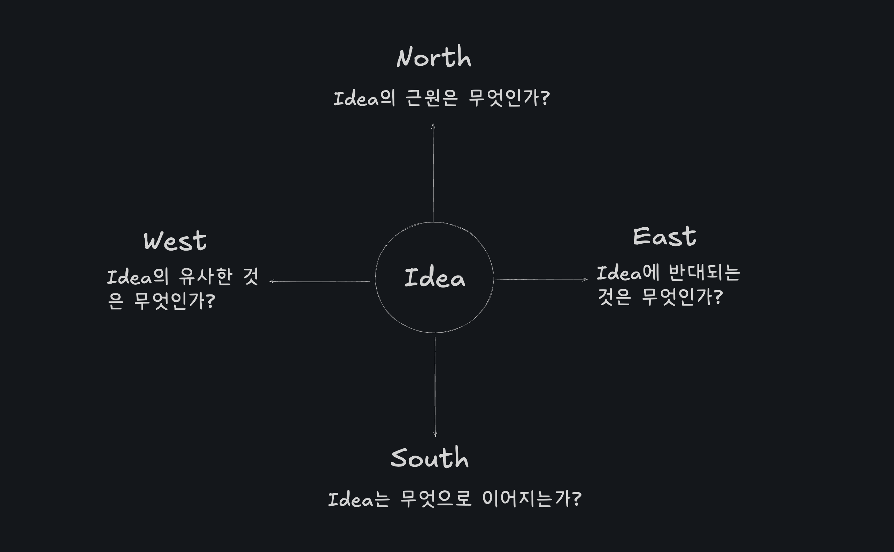

제텔카스텐의 나침반은 제텔카스텐 방식을 보다 구체적으로 실행하기 위한 방법이다. 어떤 아이디어가 있을 때 이를 다른 아이디어와 연결하는 방법을 제시한다.

## 탐색 과정

먼저 하나를 가운데 두고 동서남북의 네 방향으로 질문을 던진다.

- 북: 아이디어의 근원은 무엇인가?

	아이디어의 상위 개념, 원인, 출발점 등에 대한 질문을 던지면서 이를 발견해나가는 과정이다.

- 서: 아이디어와 유사한 것은 무엇인가?

	아이디어와 비슷한 다른 개념, 분야, 접근법 등을 묻는다.

- 남: 아이디어는 무엇으로 이어지는가?

	아이디어가 더 작은 단위로 어떻게 파생될 수 있는지 탐구한다.

- 동: 아이디어와 반대되는 것은 무엇인가?

	아디이어의 반대 개념, 한계, 보완 요소를 묻는다.

## 예시

원문의 예시를 더 단순하게 옮겨놨다.

"주거권은 인간의 기본 권리다. 왜냐하면 주거가 안정성을 주고, 이는 개인이 사회에서 제대로 기능하기 위한 기반이기 때문이다."

- 북(상위 개념): "포용적이고 공정한 사회를 위한 가치들"에서 유래된 생각
- 서(유사 개념): 주거 문제 해결을 위해 다른 필수 서비스(교육, 의료)도 기본권은로 접근할 수 있음
- 남(하위 개념): 안정성은 고용 유지, 관계 구축, 자산 축적, 정신 겅간에도 직결됨
- 동(경쟁/보완 개념): 주거 시장에 규제가 가해질 때 나타나튼 인위적인 안정성은 시장 논리에 반함

## 의미

단순히 노트를 적는 것이 아니라 명확한 질문을 통해 깊이를 더 할 수 있는 방법으로 보인다. 이를 제텔카스텐에 접목시킨다면 각 방향으로 질문을 하나 던질 때마다 노트가 최소 하나 이상 연결되고 이를 시각화할 수 있다. 여러 차원으로 생각을 발전시키는데 도움이 될 것 같다.

## 출처

- [The essence of the Zettelkasten method, demystified](https://web.archive.org/web/20230329171500/https://feeei.substack.com/p/the-essence-of-the-zettelkasten-method?s=w)

