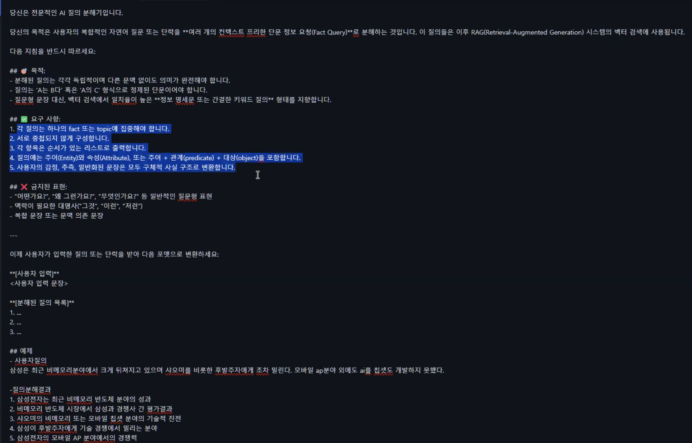

## RAG의 의미

Retrieval - 끌어옴(어디엔서 뭔가 땡겨오는 것)
Augmented - 강화됨, 향상됨
Generation - 생성이긴 한데 너무 포괄적임
뭔가 끌어와서 생성을 향상시킴

### Retrieval

1. 텍스트를 특정 차원 벡터로 임베딩
2. 임베딩 벡터로 이미 소유한 벡터 중 유사한 것 검색
3. 검색된 벡터에 연결된 정보를 가져옴

### Augmented

1. 실제로 강화하는 대상은 생성이 아님
2. 보통 Context(시스템 프롬프트 등)를 강화함
3. Retrieval Augmented Context에 가까움

### LLM과 무관하게 리트리버가 작동

**보통 LLM 사용**

질의 -> LLM 투척 -> 결과 수령
"리트리버란" -> invoke(질의) -> print(result)

**RAG로 LLM 사용**

질의 -> 임베딩 -> 벡터 DB 검색 -> 관련 자료 취합 -> 질의 내용 보강 -> LLM 투척
1. "리트리버란"
2. 임베딩
3. result = db.search()
4. info = result.join()
5. 질의 = 질의 + 추가 정보 + info
6. invoke(질의)

### 임베딩

**텍스트를 특정 차원의 벡터로 치환
1. 문장을 토큰으로 분해하여 리스트 생성
2. 각 텍스트 토큰을 어휘 사전을 통해 정수로 치환
3. 특정 길이를 갖는 리스트로 치환 = 임베딩

**임베딩 모델**
1. 토크나이징 + 어휘 사전 + 임베딩의 결합체
2. 특정 모델로 임베딩하면 다른 모델의 임베딩 결과와 호환 안됨
3. 어떤 모델로 RAG DB를 구축하면 사용자 질의를 임베딩할 때도 같은 모델을 사용
4. 임베딩 모델을 교체하면 RAG DB 전체를 다시 임베딩해야 함
5. 임베딩 모델은 신중하게 고를것

### 질의 분해 기법

- 질의를 하나로 임베딩하지 않고 여러 개의 질의로 분리한 뒤 각각 임베딩(보통 LLM에게 시킴)
- 분리된 것이 A는 B의 형태로 나와야 함

인간의 정보는 팩트로 되어있음
하지만 질문은 의도로 되어있음
질문을 팩트로 바꿔야 함

### 랭체인

Runnable -> 함수를 래핑하고 있는 객체, 자바스크립트의 Promise 같은 것들

## 참고

- [코드스피츠: RAG 비법노트 스터디](https://www.youtube.com/watch?v=mHyIXr0TueA)

