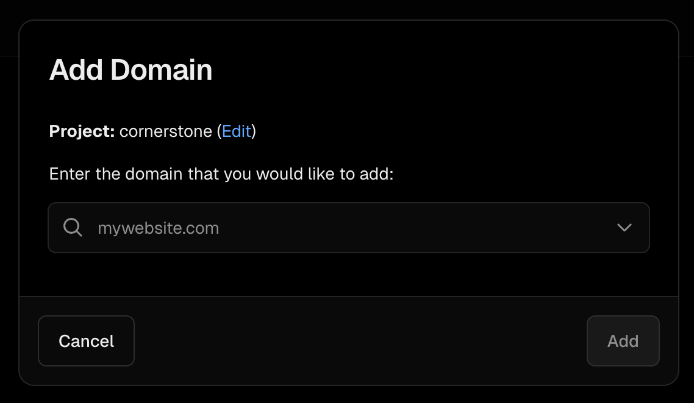

## 도메인 구입

Vercel에서 직접 구입해도 되지만 조금 더 비싼 느낌이다. 나는 [spaceship](https://www.spaceship.com)이라는 [[./domain-name-register|도메인 레지스터]]를 통해  도메인을 구입했다. 다른 곳도 마찬가지인지는 모르겠지만 네임서버와 DNS 관리 콘솔을 제공한다. 

## Vercel에 도메인 등록

1. Vercel 프로젝트 콘솔의 `Domains` 탭 진입
2. `Add Exsiting` 버튼 클릭
3. 도메인을 등록할 프로젝트 선택
4. 구입한 도메인 이름 등록

여기까지 진행했다면 A 타입의 [[./dns-records|도메인 레코드]]를 등록해야 한다는 메세지를 확인할 수 있다.
Vercel의 IP 중 하나인 `76.76.21.21`을 도메인의 레코드로 등록해야 한다.

## 레코드 등록

spaceship의 `Advanced DNS` 메뉴에서 DNS를 관리할 수 있다. Host는 `@`, Type은 `A`, Value는 `76.76.21.21`을 기입한다. 시간이 조금 지나면 Vercel에서 자동으로 감지하고 도메인 등록을 완료한다.

## 확인

[cornerstone.wiki](https://cornerstone.wiki)라는 내 도메인을 갖게 됐다.
