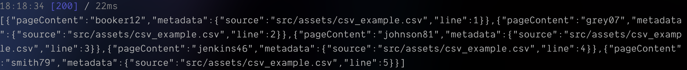

LangChain이 CSV 파일을 파싱하려면 [d3-dsv](https://www.npmjs.com/package/d3-dsv) 파서를 먼저 설치해야 한다.

```bash
pnpm add d3-dsv@2
```

테스트를 위한 파일은 [이곳](https://support.staffbase.com/hc/en-us/articles/360007108391-CSV-File-Examples)에서 받았다.

```bash title="csv_example.csv"
Username;Login email;Identifier;First name;Last name
booker12;rachel@example.com;9012;Rachel;Booker
grey07;;2070;Laura;Grey
johnson81;;4081;Craig;Johnson
jenkins46;mary@example.com;9346;Mary;Jenkins
smith79;jamie@example.com;5079;Jamie;Smith
```
```ts title="대략적인 코드"
// ...생략
import { CSVLoader } from '@langchain/community/document_loaders/fs/csv';

const csvLoader = new CSVLoader('src/assets/csv_example.csv');

export const document_loader = {
  csv: async () => {
    try {
      const documents = await csvLoader.load();
      return JSON.stringify(documents);
    } catch (error) {
      console.error('Error loading CSV:', error);
      return [];
    }
  },
};
```

특정 컬럼만 가져오고 싶다면,

```ts title="하지만 에러가 발생한다 ?!"
// ...생략
import { CSVLoader } from '@langchain/community/document_loaders/fs/csv';

const csvLoader = new CSVLoader(
	'src/assets/csv_example.csv',
	'Username' // [!code ++]
);

export const document_loader = {
  csv: async () => {
    try {
      const documents = await csvLoader.load();
      return JSON.stringify(documents);
    } catch (error) {
      console.error('Error loading CSV:', error);
      return [];
    }
  },
};
```

에러가 발생하는 이유는 `;`로 컬럼이 구분되어 있기 때문이다.
파서는 기본적으로 쉼표를 기준으로 컬럼을 구분하기 때문에 옵션을 넣어줘야 한다.

```ts title="CSVLoaderOption 전달"
// ...생략
import { CSVLoader } from '@langchain/community/document_loaders/fs/csv';

const csvLoader = new CSVLoader(
	'src/assets/csv_example.csv',
	'Username' // [!code --]
	{ separator: ';', column: 'Username', } // [!code ++]
);

export const document_loader = {
  csv: async () => {
    try {
      const documents = await csvLoader.load();
      return JSON.stringify(documents);
    } catch (error) {
      console.error('Error loading CSV:', error);
      return [];
    }
  },
};
```


`Username`만 잘 반환하고 있다.

## 참고

- [How to load CSV data](https://js.langchain.com/docs/how_to/document_loader_csv/)

